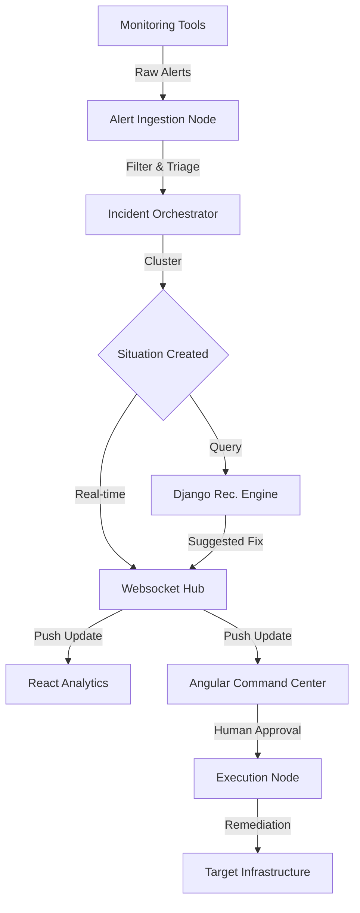

# Human-in-the-Loop Response Orchestrator 🛡️

**Transforming Chaos into Secure, Intelligent Action.**

Modern infrastructure generates thousands of alerts every day. SREs and DevOps engineers are drowning in "noisy" notifications, often leading to **alert fatigue** and **risky automated fixes** that can accidentally crash production.

I built this platform to solve that problem by orchestrating the entire incident lifecycle with a human at the center.

---

## ⚡ Quick Highlights
- 🧠 **Smart Clustering:** No more alert storms.
- 🛡️ **Fail-Safe Execution:** No script runs without human approval.
- 📊 **Dual-View UI:** Separation of high-speed metrics and secure workflows.
- 🚀 **Polyglot Power:** Node.js performance meets Python's data intelligence.

---

## 🌪️ The Real-World Problem
In high-scale environments, automation is a double-edged sword. While it speeds up recovery, "unsupervised" automation can expand the blast radius of a failure if the root cause is misunderstood.
- **Alert Overload:** Too many signals, not enough context.
- **Dangerous Automation:** Running scripts without human oversight is a liability.
- **Fragmented Visibility:** Metrics are in one place, response tools in another.

## 🛡️ My Solution: Chaos to Order
The Human-in-the-Loop Response Orchestrator bridges the gap between raw data and safe remediation. I didn't just automate; I **augmented** the engineer with intelligence while keeping them in control.

---

## 📐 Data & Incident Lifecycle
This is how an incident moves through my system:



---

## 🏗️ Architectural Deep Dive (Tech Stack & Concepts)

### Why a Polyglot Stack?
I chose a specialized stack to solve specific engineering challenges, leveraging the core strengths of each environment:

#### 1. Backend (Node.js & Express)
*   **Concepts:** Event-loop, Non-blocking I/O, Middleware.
*   **Functionality:** Used in `alert-ingestion-node` and `incident-orchestrator-node` to handle high-concurrency alert streams without bottlenecking.

#### 2. Intelligence Engine (Python & Django)
*   **Concepts:** ORM, Pandas, Scikit-learn (Pattern Matching).
*   **Functionality:** `recommendation-django` compares current incidents against historical data to find the safest possible fix.

#### 3. Real-time Communication (Socket.io)
*   **Concepts:** WebSockets, Event Broadcasting.
*   **Functionality:** Pushes updates to the UI in milliseconds, ensuring zero-latency response times during critical outages.

---

## 🕹️ Micro-Frontend Strategy (Why Two UIs?)

I split the UI into two specialized applications to maintain a clear "Separation of Concerns":

### 1. Operational Intelligence Hub (React + Vite)
- **Concept:** High-speed Virtual DOM.
- **Functionality:** High-density analytics for real-time monitoring and holistic system insights.


### 2. Secure Command Center (Angular)
- **Concept:** Robust DI & RxJS state management.
- **Functionality:** The action layer where incidents are triaged and secure actions are triggered with a human click.


---

## 📂 Project Structure
A map of where everything lives:

```text
Human-in-the-loop-Response-Orchestrator/
├── assets/                     # Project media & documentation images
├── backend/
│   ├── alert-ingestion-node/   # Node.js service for raw data ingestion
│   ├── incident-orchestrator/  # Core logic for clustering & state
│   ├── recommendation-django/  # Python intelligence & historical analysis
│   └── execution-node/         # Safe wrapper for running remediation
├── frontend/
│   ├── angular-responder/      # Secure Command Center (Action)
│   └── react-analytics/        # Intelligence Hub (Insight)
├── realtime/
│   └── websocket-hub/          # Socket.io broadcast layer
└── start-all.ps1               # Single-command dev environment launch
```

---

## 🚀 Speed Run (Local Setup)

1.  **Prerequisites:** Node.js (v18+), Python (v3.9+).
2.  **Launch Everything:**
    ```powershell
    ./start-all.ps1
    ```
3.  **Access:**
    -   **Command Center:** [http://localhost:4200](http://localhost:4200)
    -   **Intelligence Hub:** [http://localhost:5173](http://localhost:5173)

---
*Built with ❤️ for the engineers who keep the world running.*
